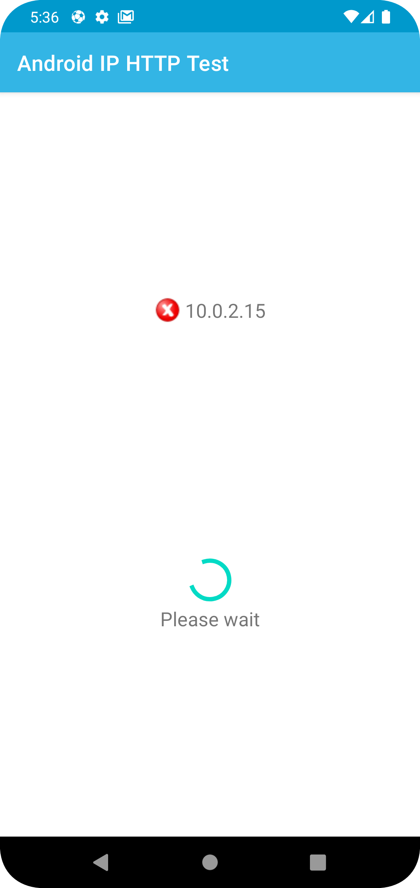
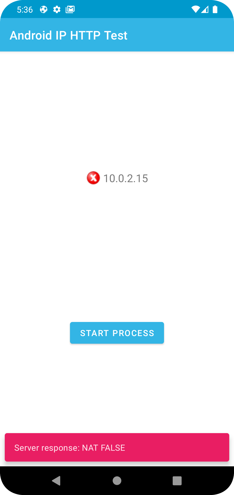
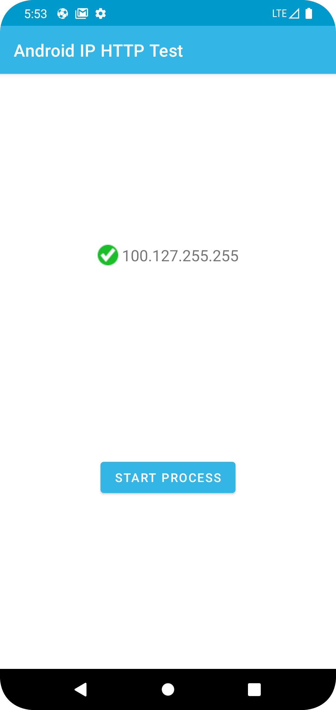
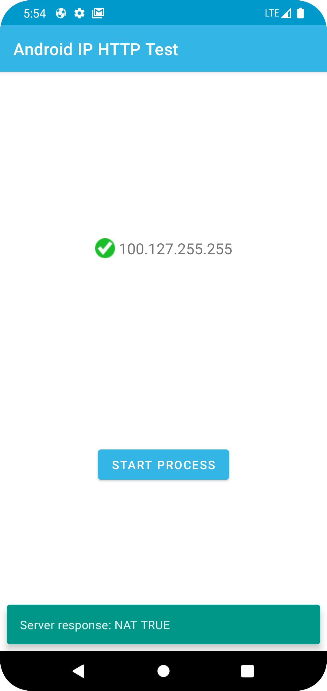

# Android App: IP Address Checker

## Overview

This Android application allows users to retrieve the IP address of their device, send it to a server, and display the server's response. The app integrates C++ code to retrieve the device's IP address and makes an HTTP POST request to a provided server URL. It then displays the server's response using Snackbar messages with appropriate colors for success and failure.
Requirements

    Android device or emulator running API level 24 (Android 7.0, Nougat) or higher.
    Internet connection to send HTTP requests and receive responses.

## Features

    Retrieves the device's IP address using C++ code.
    Validates the IP address format before sending it to the server.
    Sends the IP address to a server via an HTTP POST request.
    Displays server response using Snackbar messages with appropriate colors.

## Installation

    Clone or download the repository.
    Open the project in Android Studio.
    Build and run the app on an Android device or emulator.

## Usage

    Launch the app on your Android device.
    Click the "Start Task" button to retrieve the device's IP address and send it to the server.
    Wait for the server response.
    View the server response displayed as a Snackbar message with a green or red background indicating success or failure, respectively.

## Download

You can download the latest version of the app from the [app-debug.apk](outputs/apk/debug/app-debug.apk) folder. This APK contains all the features and improvements of the latest release.

## Screenshots

| Screenshot 1 | Screenshot 2 |
|--------------|--------------|
|  |  |
|  |  |

## Dependencies

    OkHttp: Library for making HTTP requests.

## License

This project is licensed under the MIT License - see the LICENSE file for details.
Acknowledgements

    Special thanks to Cloudonix.io for providing the task specifications.

## Contributing

Contributions are welcome! Feel free to submit issues or pull requests.
